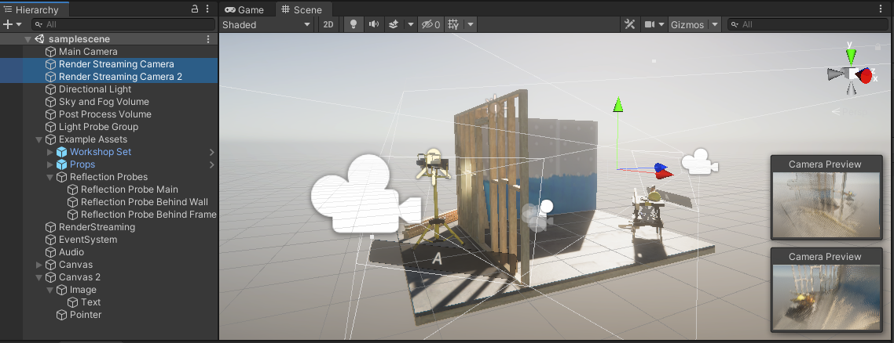

# Unity Render Streaming

This package contains public APIs and project samples that are built on top of our **Unity Render Streaming**. We can develop a peer-to-peer streaming solution quickly by using this package.

> [!Video https://www.youtube.com/embed/c2pp_T5xzeU]

## Main features

This package provides the main features below.

- Video streaming
- Audio streaming
- Remote control

### Video streaming

We can broadcast video rendered on Unity to browsers via network. For example, It can show the video rendered with HDRP on the browser on the iPad. In addition, broadcasting from multiple cameras is supported. 

### Audio streaming
This package enables streaming sounds generated on Unity. And it can cast to multi-browsers simultaneously.

### Remote control

It is possible to send input messages to Unity from the browser, and sending inputs from multiple browsers is supported. Mouse, keyboard, touch, and gamepad are supported as input devices on the browser. For more information, please see the [Browser input process](en/input.md) page.

## Requirements

This version of Render Streaming is compatible with the following versions of the Unity Editor
- **Unity 2019.4**

> [!NOTE]
> Because this template depends on `HDRP 7.3`, it does not work correctly older versions than `Unity 2019.4`.

| Platform    | Graphics API | Hardware Encoder                                                                                                         | Software Encoder   |
| ----------- | ------------ | ------------------------------------------------------------------------------------------------------------------------ | ------------------ |
| Windows x64 | DirectX11    | :white_check_mark: (Require [NVIDIA Graphics card](https://developer.nvidia.com/video-encode-decode-gpu-support-matrix)) | :white_check_mark: | 
| Windows x64 | DirectX12    | :white_check_mark: (Require [NVIDIA Graphics card](https://developer.nvidia.com/video-encode-decode-gpu-support-matrix)) | :white_check_mark: | 
| Windows x64 | OpenGL       |                                                                                                                          |                    |
| Windows x64 | Vulkan       |                                                                                                                          |                    | 
| Linux x64   | OpenGL       | :white_check_mark: (Require [NVIDIA Graphics card](https://developer.nvidia.com/video-encode-decode-gpu-support-matrix)) |                    |
| Linux x64   | Vulkan       |                                                 	                                                                        |                    |
| MacOS       | Metal        |                                                 	                                                                        | :white_check_mark: |

> [!WARNING]
> In the current version, The combination of Linux and HDRP is not supported. Need to select`OpenGL` in "Graphics API" and use `Legacy` rendering pipeline.

> [!NOTE]
> Supporting OpenGL API on MacOS is not planned.

### Hardware encoder

This solution is optimised for NVIDIA graphics cards. Using a recommended graphics card will allow streaming with lower latency. See NVIDIA's [NVIDIA VIDEO CODEC SDK](https://developer.nvidia.com/video-encode-decode-gpu-support-matrix) webpage for a list of recommended graphics cards.

### Browsers

| Browser                           | Windows            | Mac                | iOS                | Android            |
| --------------------------------- | ------------------ | ------------------ | ------------------ | ------------------ |
| Google Chrome                     | :white_check_mark: | :white_check_mark: |                    | :white_check_mark: |
| Safari                            |                    | :white_check_mark: | :white_check_mark: |                    |
| Firefox                           | :white_check_mark: |                    |                    |                    |
| Microsoft edge (Chromium based)   | :white_check_mark: |                    |                    |                    |

> [!NOTE]
> It may not work properly on some browsers caused by depending on the status of support about WebRTC.

### Furioos compatibility

> [!NOTE]
> This is an experimental feature.

**Unity Render Streaming** is also supported natively by Furioos platform https://www.furioos.com/ .
That means that you can easily build a RenderStreaming application, upload it on Furioos and enjoy all the features of RenderStreaming without worrying about the deployment and scalability issues of your project.
To do so, the requirement is to select "FurioosSignaling" in the "Signaling server type" parameter of the RenderStreaming script.
This allow your application to connect to Furioos services when running on the managed virtual machines.
Then just build a standalone Windows version of your application, zip it and upload it on your account at https://portal.furioos.com/ .

## Samples

Currently, there are three samples:

### HDRP sample

Importing this sample will automatically install and setup our HDRP sample assets along with the [HDRP](https://docs.unity3d.com/Packages/com.unity.render-pipelines.high-definition@latest) *(com.unity.render-pipelines.high-definition)* package.

### URP sample

Importing this sample will automatically install and setup our URP sample assets along with the [URP](https://docs.unity3d.com/Packages/com.unity.render-pipelines.universal@latest) *(com.unity.render-pipelines.universal)* package.

### Legacy pipeline sample

This is the simplest sample with legacy pipeline.

## Other Languages

- [Japanese](./jp/index.md)
