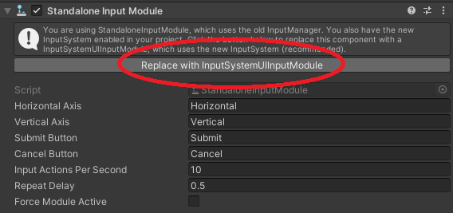

# Browser Input Process

Unity Render Streaming supports user input from the browser, making it possible to replicate operating Unity in the browser. 

## Input devices

Browser input is supported for the following devices. Multiple devices can be used simultaneously. 

- Mouse
- Keyboard
- Touch
- Gamepad

The browser sends byte sequences, and Unity uses the `New Input System`.

## Data Format

### Mouse Events

|index|value|size|
|-------|-----|-----|
|0|0|1|
|1|position x|2|
|3|position y|2|
|5|button|1|

### Keyboard Events

|index|value|size|
|-------|-----|-----|
|0|1|1|
|1|key code|1|

### Touch Events

The data size for touch events varies depending on the number of detected fingers. The `length` value of the first byte corresponds to the number of detected fingers.

|index|value|size|
|-------|-----|-----|
|0|2|1|
|1|phase|1|
|2|length|1|
|3|position x|2|
|5|position y|2|
|7|force|4|

### Gamepad Events

There are four types of gamepad events. Each type has a different data format. 

| event name | value |
|-------|-----|
| button down | 0 |
| button up | 1 |
| button pressed | 2 |
| axis | 3 |

For `button down` 、 `button up` 、 `button pressed`:

|index|value|size|
|-------|-----|-----|
|0|5|1|
|1|event type|1|
|2|button index|1|
|3|value|8|

For `axis`:

|index|value|size|
|-----|-----|----|
|0|5|1|
|1|event type|1|
|2|button index|1|
|3|axis x|8|
|11|axis y|8|

## Multi-user

The `RemoteInputReceiver` class can be used to control inputs from multiple users. Call `RemoteInputReceiver.Create` to create a `RemoteInput` instance. Next the message from the `RTCDataChannel`is passed to the `RemoteInput.ProcessInput` method.

```CSharp
// Create a RemoteInput instance
RemoteInput input = RemoteInputReceiver.Create();
channel.OnMessage = bytes => input.ProcessInput(bytes);
```

Get the input device from the `RemoteInput` instance and reference the device value to control the input. Below is an example of using keyboard input. 

```CSharp
// Get the keyboard device, process on w key press
Keyboard keyboard = input.RemoteKeyboard;
if(keyboard.wKey.isPressed)
{
   // ... 
}
```

## Using Unity UI

If you use UnityUI, press `Replace with InputSystemUIInputModule` in the `StandaloneInputModule` that is attached to the same object as the `EventSystem` component.



You can control the UnityUI placed on the game scene from browser.

> [!NOTE]
> If the Unity application is in Background, even if the `RunInBackground` checkbox is On, you can not control the UnityUI from browser. This issue will be fixed in `com.unity.inputsystem`.


### Workaround for using UnityUI on RunInBackground

If use UnityUI in the background, follow the steps below.

1. Update `com.unity.inputsystem` to `1.1.0-preview.2` on PackageManager.

2. In Project Setting->Player->Other Setting, check `Allow 'unsafe' code`.

3. Replace `EventSystem` in the Scene with the following component.

```CSharp
using UnityEngine.EventSystems;
using UnityEngine.InputSystem;
using UnityEngine.InputSystem.LowLevel;

public class CustomEventSystem : EventSystem
{
    protected override void Awake()
    {
        base.Awake();
        unsafe
        {
            InputSystem.onDeviceCommand += InputSystemOnDeviceCommand;
        }
    }

    private static unsafe long? InputSystemOnDeviceCommand(InputDevice device, InputDeviceCommand* command)
    {
        if (command->type != QueryCanRunInBackground.Type)
        {
            // return null is skip this evaluation
            return null;
        }

        ((QueryCanRunInBackground*)command)->canRunInBackground = true;
        return InputDeviceCommand.GenericSuccess;
    }

    protected override void OnApplicationFocus(bool hasFocus)
    {
        //Do not change focus flag on eventsystem
    }
}
```

4. (Optional) For UnityEditor, Open Window->Analysis->Input Debugger and turn on `Lock Input to Game View` in Options.
